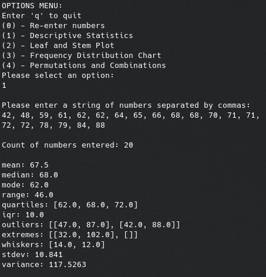
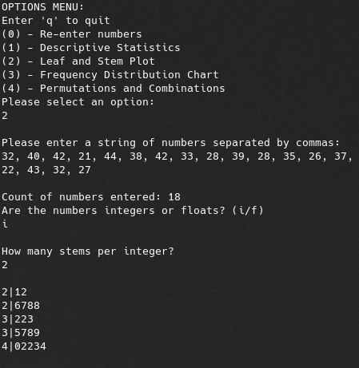
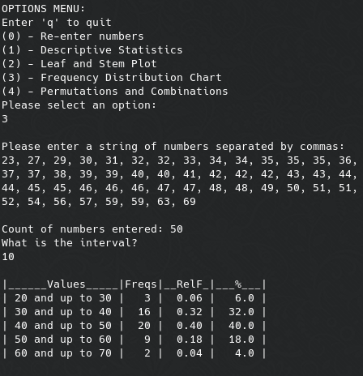
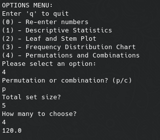
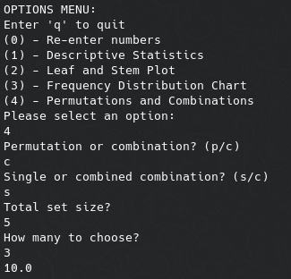
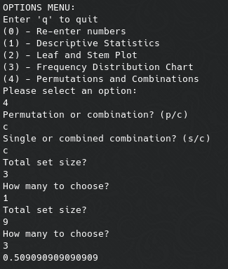

# stats-tools

Basic cli statistics tools

## About

Stats Tools can output formatted statistics, leaf-and-stem plots, frequency distribution charts, and calculate permutations and combinations.

## Usage

- Run `python3 app.py` to run the application
- The user is prompted for the type of operation you wish to perform.
  - The operation is selected by entering an integer, 0 - 4.
  - Options are:
    ( 0 ) Re-enter numbers
    ( 1 ) Descriptive Statistics
    ( 2 ) Leaf and Stem Plot
    ( 3 ) Frequency Distribution Chart
    ( 4 ) Permutations and Combinations calculator
- When prompted, please enter a string of numbers separated by commas.
- Enter `q` in the 'Options Menu' to quit.

## Examples

- Descriptive Statistics
  

 

- Leaf and Stem plot
  

 

- Frequency Distribtion Chart
  

 

- Permutations and Combinations calculator
  - 5P4
  

  - 5C3
  
  
  - (3C1 * 9C3) / 12C4
  